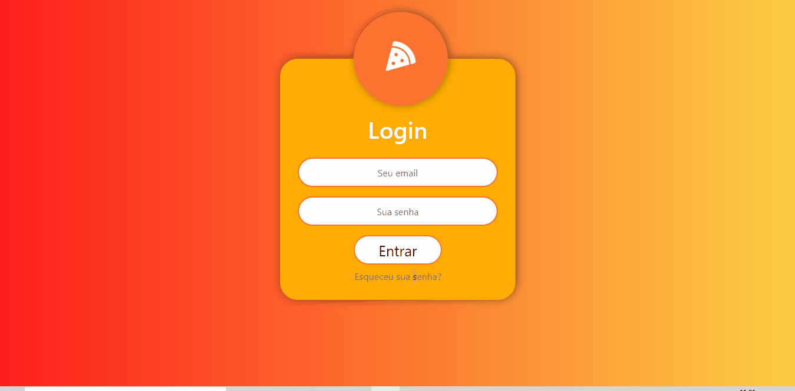

<h1 align = "center"> Catalogo De Pizzaria. </h1>

Sistema de catalogo de pizza dinamico onde pode se editar as imagens e textos pelo administrativo.

	
	

	
	

# 🚀 Tecnologias

	Este projeto foi desenvolvido com as seguintes tecnologias:

- ✔️ PHP

- ✔️ CodeIgniter

- ✔️ Bootstrap

- ✔️ MySQL

- ✔️ JavaScript

